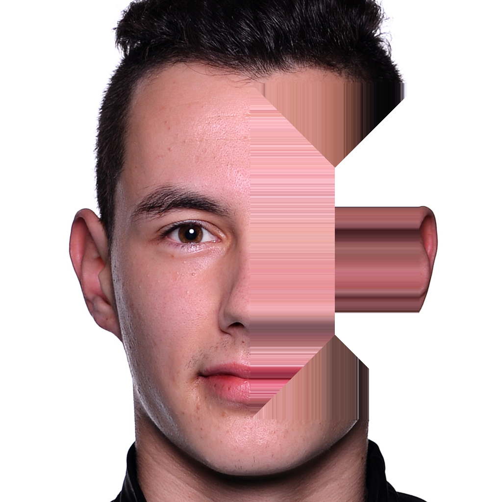
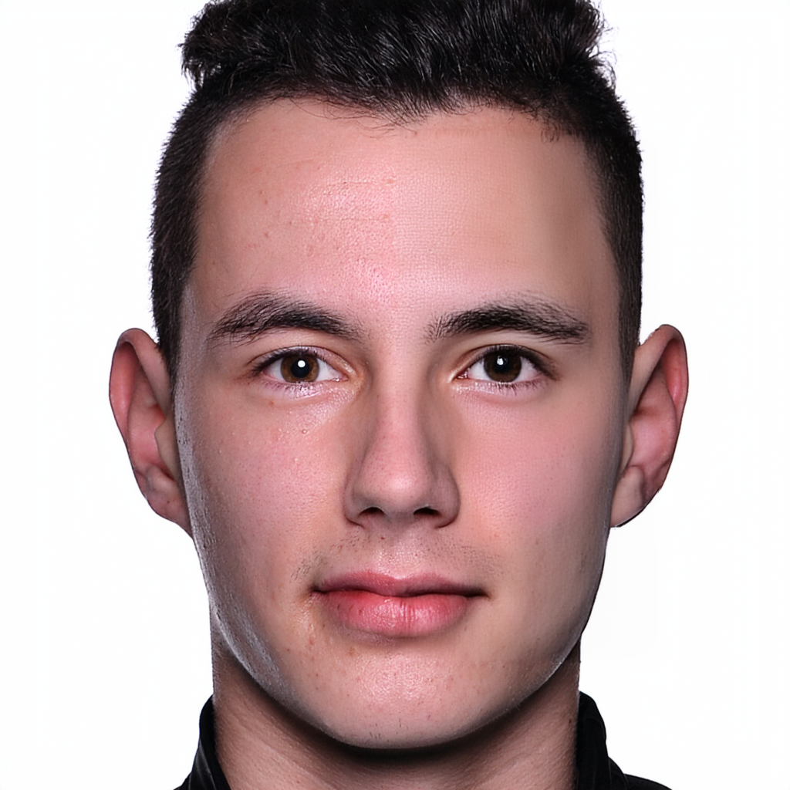

# SONIC: Spectral Optimization of Noise for Inpainting with Consistency

[](https://ubc-vision.github.io/sonic/)
[](https://arxiv.org/abs/2511.19985)


<span class="author-block">
  <a href="">Seungyeon Baek</a>,
</span>
<span class="author-block">
  <a href="">Erqun Dong</a>,
</span>
<span class="author-block">
  <a href="">Shadan Namazifard</a>,
</span>
<span class="author-block">
  <a href="">Mark J. Matthews</a>,
</span>
<span class="author-block">
  <a href="https://www.cs.ubc.ca/~kmyi/">Kwang Moo Yi</a>
</span>

<hr>

## Inpainting Example
Given a nearest-pixel inpainted image (left) and its corresponding prompt, we can inpaint the image via noise optimization.

<table>
  <tr>
    <td align="center">Input</td>
    <td align="center">Inpainted Output</td>
  </tr>
  <tr>
    <td></td>
    <td></td>
  </tr>
</table>

```
"A young man with short black hair styled upward, dark brown eyes, and fair skin with light stubble. He has well-defined eyebrows and is wearing a black collar or shirt. The background is a clean white."
```

<hr>

## Environment Setup

### Installation

1. **Clone the repository**
```bash
git clone git@github.com:ubc-vision/sonic.git
cd sonic
```

2. **Install PyTorch**

Install PyTorch with CUDA support. Visit [https://pytorch.org](https://pytorch.org) for installation instructions.
The codebase was tested with PyTorch 2.7.1+cu128, and 2.9.1+cu128.

3. **Install required packages**

For inpainting only:
```bash
pip install diffusers==0.31.0 transformers==4.46.3 accelerate==1.9.0 pillow==10.4.0 numpy==1.26.4 protobuf==6.31.1 sentencepiece==0.2.0
```

For metrics evaluation (optional):
```bash
pip install torchmetrics torchvision tqdm pandas open_clip_torch hpsv2 image-reward
```

## Usage

### Option 1: Using sample datasets

Run the inpainting script with predefined datasets:

```bash
python sonic_inpaint.py \
    --dataset_name FFHQ \
    --image_index 00064 \
    --num_iterations 20 \
    --step_nums 20 \
    --CFG_scale 2.0 \
    --learning_rate 3.0
```

### Option 2: Using custom images

Run the inpainting script with custom images and prompts:

```bash
python sonic_inpaint.py \
    --image_path /path/to/image.png \
    --mask_path /path/to/mask.png \
    --prompt "Your text prompt here" \
    --num_iterations 20 \
    --step_nums 20 \
    --CFG_scale 2.0 \
    --learning_rate 3.0
```

### Output

Results are saved to `inpaint_results/{dataset_name}_{image_name}_steps{step_nums}_iter{num_iterations}/`:
- `target_image.png` - Masked target image
- `epsilon/` - Optimized noise at each iteration
- `x_0_hat/` - Predicted clean images during optimization
- `inpainted_output/inpainted.png` - Final inpainted result

## Code Release
- ✅ Inpainting code with sample images and prompts
- ✅ Environment setup guide
- ✅ Metrics code
- ✅ (Experimental) Wan 2.1 code update

## Citation
```
@article{baek2025sonicspectraloptimizationnoise,
      title={SONIC: Spectral Optimization of Noise for Inpainting with Consistency}, 
      author={Seungyeon Baek and Erqun Dong and Shadan Namazifard and Mark J. Matthews and Kwang Moo Yi},
      year={2025},
      eprint={2511.19985},
      archivePrefix={arXiv},
      primaryClass={cs.CV},
      url={https://arxiv.org/abs/2511.19985}, 
}
```
